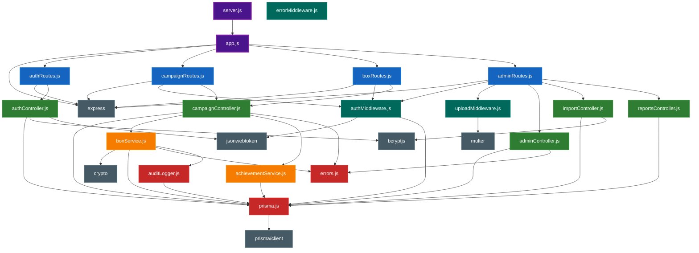

# 🕸️ COMPLETE IMPORT DEPENDENCY GRAPH

**Project**: Mystery Box Campaign Application  
**Purpose**: Visual representation of ALL import relationships  
**Date**: 2025-11-25  

---

## 📊 MERMAID DEPENDENCY GRAPH

### Complete Frontend Import Graph

```mermaid
graph TB
    %% Entry Point
    MainJSX[main.jsx]
    AppJSX[App.jsx]
    IndexCSS[index.css]
    
    %% Pages - User
    LoginPage[LoginPage.jsx]
    DashboardPage[DashboardPage.jsx]
    MyPrizesPage[MyPrizesPage.jsx]
    
    %% Pages - Admin
    AdminLoginPage[admin/AdminLoginPage.jsx]
    AdminDashboardPage[admin/AdminDashboardPage.jsx]
    CampaignListPage[admin/CampaignListPage.jsx]
    CampaignDetailPage[admin/CampaignDetailPage.jsx]
    CampaignEditPage[admin/CampaignEditPage.jsx]
    AdminUserListPage[admin/AdminUserListPage.jsx]
    AdminAuditPage[admin/AdminAuditPage.jsx]
    
    %% Components
    MysteryBox[MysteryBox.jsx]
    RoomCard[RoomCard.jsx]
    ProtectedRoute[ProtectedRoute.jsx]
    AdminProtectedRoute[AdminProtectedRoute.jsx]
    ImageUpload[ImageUpload.jsx]
    ProgressBar[ProgressBar.jsx]
    StatisticsCard[StatisticsCard.jsx]
    AchievementBadge[AchievementBadge.jsx]
    ImportUsersModal[ImportUsersModal.jsx]
    
    %% Services
    ApiClient[apiClient.js]
    CampaignApi[campaignApi.js]
    AdminUserApi[adminUserApi.js]
    AdminReportsApi[adminReportsApi.js]
    
    %% Utils
    ImageUrl[imageUrl.js]
    
    %% External Libraries
    React[react]
    ReactDOM[react-dom/client]
    ReactRouter[react-router-dom]
    FramerMotion[framer-motion]
    Axios[axios]
    LucideReact[lucide-react]
    
    %% Entry Point Connections
    MainJSX --> React
    MainJSX --> ReactDOM
    MainJSX --> ReactRouter
    MainJSX --> AppJSX
    MainJSX --> IndexCSS
    
    %% App.jsx Connections
    AppJSX --> ReactRouter
    AppJSX --> LoginPage
    AppJSX --> DashboardPage
    AppJSX --> MyPrizesPage
    AppJSX --> AdminLoginPage
    AppJSX --> AdminDashboardPage
    AppJSX --> CampaignListPage
    AppJSX --> CampaignDetailPage
    AppJSX --> CampaignEditPage
    AppJSX --> AdminUserListPage
    AppJSX --> AdminAuditPage
    AppJSX --> ProtectedRoute
    AppJSX --> AdminProtectedRoute
    
    %% LoginPage Connections
    LoginPage --> React
    LoginPage --> ReactRouter
    LoginPage --> FramerMotion
    LoginPage --> LucideReact
    LoginPage --> ApiClient
    
    %% DashboardPage Connections
    DashboardPage --> React
    DashboardPage --> FramerMotion
    DashboardPage --> ReactRouter
    DashboardPage --> LucideReact
    DashboardPage --> ApiClient
    DashboardPage --> MysteryBox
    DashboardPage --> RoomCard
    DashboardPage --> ImageUrl
    
    %% MyPrizesPage Connections
    MyPrizesPage --> React
    MyPrizesPage --> ReactRouter
    MyPrizesPage --> ApiClient
    MyPrizesPage --> ImageUrl
    
    %% Admin Pages Connections
    AdminLoginPage --> React
    AdminLoginPage --> ReactRouter
    AdminLoginPage --> ApiClient
    
    AdminDashboardPage --> React
    AdminDashboardPage --> ReactRouter
    AdminDashboardPage --> ApiClient
    
    CampaignListPage --> React
    CampaignListPage --> ReactRouter
    CampaignListPage --> ApiClient
    
    CampaignDetailPage --> React
    CampaignDetailPage --> ReactRouter
    CampaignDetailPage --> ApiClient
    CampaignDetailPage --> CampaignApi
    CampaignDetailPage --> ImageUrl
    
    CampaignEditPage --> React
    CampaignEditPage --> ReactRouter
    CampaignEditPage --> ApiClient
    
    AdminUserListPage --> React
    AdminUserListPage --> ReactRouter
    AdminUserListPage --> ApiClient
    AdminUserListPage --> AdminUserApi
    AdminUserListPage --> ImportUsersModal
    
    AdminAuditPage --> React
    AdminAuditPage --> ReactRouter
    AdminAuditPage --> ApiClient
    
    %% Component Connections
    MysteryBox --> React
    MysteryBox --> FramerMotion
    
    RoomCard --> React
    RoomCard --> FramerMotion
    
    ProtectedRoute --> ReactRouter
    
    AdminProtectedRoute --> ReactRouter
    
    ImageUpload --> React
    
    ProgressBar --> React
    ProgressBar --> FramerMotion
    
    StatisticsCard --> React
    
    AchievementBadge --> React
    
    ImportUsersModal --> React
    ImportUsersModal --> ApiClient
    
    %% Service Connections
    ApiClient --> Axios
    
    CampaignApi --> ApiClient
    
    AdminUserApi --> ApiClient
    
    AdminReportsApi --> ApiClient
    
    %% Styling
    classDef entryPoint fill:#4a148c,stroke:#7b1fa2,stroke-width:3px,color:#fff
    classDef page fill:#1565c0,stroke:#1976d2,stroke-width:2px,color:#fff
    classDef component fill:#2e7d32,stroke:#388e3c,stroke-width:2px,color:#fff
    classDef service fill:#f57c00,stroke:#fb8c00,stroke-width:2px,color:#fff
    classDef util fill:#c62828,stroke:#d32f2f,stroke-width:2px,color:#fff
    classDef external fill:#455a64,stroke:#546e7a,stroke-width:2px,color:#fff
    
    class MainJSX,AppJSX entryPoint
    class LoginPage,DashboardPage,MyPrizesPage,AdminLoginPage,AdminDashboardPage,CampaignListPage,CampaignDetailPage,CampaignEditPage,AdminUserListPage,AdminAuditPage page
    class MysteryBox,RoomCard,ProtectedRoute,AdminProtectedRoute,ImageUpload,ProgressBar,StatisticsCard,AchievementBadge,ImportUsersModal component
    class ApiClient,CampaignApi,AdminUserApi,AdminReportsApi service
    class ImageUrl util
    class React,ReactDOM,ReactRouter,FramerMotion,Axios,LucideReact external
```



### Complete Backend Import Graph



---

## 🔍 DETAILED IMPORT ANALYSIS

### Frontend: Who Imports What?

#### 📄 DashboardPage.jsx (Most Complex Component)

**Direct Imports:**
```javascript
// React Core
import React, { useState, useEffect, useCallback, useMemo } from 'react';

// Animation
import { motion, AnimatePresence } from 'framer-motion';

// Routing
import { Link, useNavigate } from 'react-router-dom';

// Icons
import { Menu, Home, User, ArrowLeft, X, LogOut } from 'lucide-react';

// Services
import apiClient from '../services/apiClient';

// Components
import MysteryBox from '../components/MysteryBox.jsx';
import RoomCard from '../components/RoomCard.jsx';

// Utils
import { resolveImageUrl } from '../utils/imageUrl.js';
```

**Indirect Imports (via dependencies):**
- `apiClient` → `axios`
- `MysteryBox` → `react`, `framer-motion`
- `RoomCard` → `react`, `framer-motion`

**Total Dependency Depth**: 3 levels

#### 📄 apiClient.js (Critical Service)

**Direct Imports:**
```javascript
import axios from 'axios';
```

**Used By (Imported By):**
- `LoginPage.jsx`
- `DashboardPage.jsx`
- `MyPrizesPage.jsx`
- `AdminLoginPage.jsx`
- `AdminDashboardPage.jsx`
- `CampaignListPage.jsx`
- `CampaignDetailPage.jsx`
- `CampaignEditPage.jsx`
- `AdminUserListPage.jsx`
- `AdminAuditPage.jsx`
- `campaignApi.js`
- `adminUserApi.js`
- `adminReportsApi.js`
- `ImportUsersModal.jsx`

**Impact**: ⚠️ **CRITICAL** - Changes to this file affect entire application

---

### Backend: Who Imports What?

#### 📄 campaignController.js (Most Complex Controller)

**Direct Imports:**
```javascript
// Database
import prisma from '../utils/prisma.js';

// Services
import { openBoxForUser } from '../services/boxService.js';
import { getUserAchievements, checkAndUnlockAchievements } 
    from '../services/achievementService.js';

// Error Handling
import {
  CampaignInactiveError,
  NoCouponsLeftError,
  NoPrizesAvailableError,
  PrizeSelectionError,
  BoxAlreadyOpenedError,
} from '../utils/errors.js';
```

**Indirect Imports (via boxService.js):**
- `crypto` (Node.js built-in)
- `auditLogger.js` → `prisma.js` → `@prisma/client`

**Used By (Imported By):**
- `campaignRoutes.js`
- `boxRoutes.js`

**Total Dependency Depth**: 4 levels

#### 📄 boxService.js (Critical Business Logic)

**Direct Imports:**
```javascript
// Node.js Built-in
import { randomInt } from 'crypto';

// Database
import prisma from '../utils/prisma.js';

// Error Handling
import {
  CampaignInactiveError,
  NoCouponsLeftError,
  NoPrizesAvailableError,
  PrizeSelectionError,
  ServiceError,
  BoxAlreadyOpenedError
} from '../utils/errors.js';

// Audit
import { logAudit } from '../utils/auditLogger.js';
```

**Indirect Imports:**
- `prisma.js` → `@prisma/client`
- `auditLogger.js` → `prisma.js` → `@prisma/client`

**Used By (Imported By):**
- `campaignController.js`

**Impact**: ⚠️ **CRITICAL** - Core business logic for box opening

---

## 📈 DEPENDENCY DEPTH ANALYSIS

### Frontend Dependency Chains

**Longest Chain (5 levels):**
```
main.jsx 
  → App.jsx 
    → DashboardPage.jsx 
      → MysteryBox.jsx 
        → framer-motion
```

**Most Imported File:**
- `apiClient.js` - Imported by 13+ files
- `react` - Imported by all components/pages
- `framer-motion` - Imported by 8+ files

### Backend Dependency Chains

**Longest Chain (5 levels):**
```
server.js 
  → app.js 
    → campaignRoutes.js 
      → campaignController.js 
        → boxService.js 
          → auditLogger.js 
            → prisma.js 
              → @prisma/client
```

**Most Imported File:**
- `prisma.js` - Imported by all controllers, services, middlewares
- `errors.js` - Imported by all controllers and services
- `authMiddleware.js` - Used by all protected routes

---

## 🎯 CRITICAL IMPORT PATHS

### Path 1: User Opens Box

```
User Click
  ↓
DashboardPage.jsx
  → handleOpenBox()
  → apiClient.post('/boxes/:id/open')
    ↓
apiClient.js
  → axios.post()
  → Add Authorization header from localStorage
    ↓
HTTP Request to Backend
    ↓
app.js
  → Route matching: /api/boxes/*
  → boxRoutes.js
    ↓
boxRoutes.js
  → protect middleware (authMiddleware.js)
    → Verify JWT
    → Attach user to req.user
  → openBoxController (campaignController.js)
    ↓
campaignController.js
  → openBoxController()
  → openBoxForUser() (boxService.js)
    ↓
boxService.js
  → prisma.$transaction()
  → Prize selection algorithm
  → Database updates
  → logAudit() (auditLogger.js)
    ↓
Response back to Frontend
    ↓
DashboardPage.jsx
  → Update states
  → Show prize modal
```

### Path 2: User Logs In

```
User Submit Form
  ↓
LoginPage.jsx
  → handleLogin()
  → apiClient.post('/auth/login', {storeCode, password})
    ↓
apiClient.js
  → axios.post()
  → No Authorization header (first login)
    ↓
HTTP Request to Backend
    ↓
app.js
  → Route matching: /api/auth/*
  → authRoutes.js
    ↓
authRoutes.js
  → login() (authController.js)
  → No middleware (public route)
    ↓
authController.js
  → prisma.user.findUnique()
  → bcrypt.compare()
  → jwt.sign()
  → prisma.userCouponBalance.findFirst()
    ↓
Response with token
    ↓
LoginPage.jsx
  → localStorage.setItem('authToken', token)
  → localStorage.setItem('activeCampaignId', id)
  → Decode JWT → extract userId
  → localStorage.setItem('userId', userId)
  → navigate('/dashboard')
```

---

## 🔄 CIRCULAR DEPENDENCY CHECK

### ✅ No Circular Dependencies Detected

**Analysis:**
- Frontend: Clean unidirectional flow (Pages → Components → Services → External)
- Backend: Clean layered architecture (Routes → Controllers → Services → Utils)

**Best Practices Followed:**
- Services don't import controllers ✅
- Components don't import pages ✅
- Utils don't import services ✅
- Clear separation of concerns ✅

---

## 📦 EXTERNAL DEPENDENCIES

### Frontend (package.json)

```json
{
  "dependencies": {
    "react": "^18.x",
    "react-dom": "^18.x",
    "react-router-dom": "^6.x",
    "framer-motion": "^10.x",
    "axios": "^1.x",
    "lucide-react": "^0.x"
  },
  "devDependencies": {
    "vite": "^5.x",
    "tailwindcss": "^3.x",
    "@vitejs/plugin-react": "^4.x"
  }
}
```

### Backend (package.json)

```json
{
  "dependencies": {
    "express": "^4.x",
    "prisma": "^5.x",
    "@prisma/client": "^5.x",
    "bcryptjs": "^2.x",
    "jsonwebtoken": "^9.x",
    "cors": "^2.x",
    "dotenv": "^16.x",
    "multer": "^1.x",
    "morgan": "^1.x",
    "sirv": "^2.x"
  }
}
```

---

## 🧩 MODULE COUPLING ANALYSIS

### High Coupling (Expected & Acceptable)

**apiClient.js ↔ All Pages/Services**
- **Reason**: Central HTTP client
- **Impact**: Changes require testing all API calls
- **Mitigation**: Well-tested, stable interface

**prisma.js ↔ All Controllers/Services**
- **Reason**: Single database client instance
- **Impact**: Changes affect all database operations
- **Mitigation**: Prisma provides stable API

**authMiddleware.js ↔ All Protected Routes**
- **Reason**: Authentication required for most endpoints
- **Impact**: Changes affect all protected routes
- **Mitigation**: Standard JWT pattern, well-tested

### Low Coupling (Good Design)

**boxService.js ↔ campaignController.js**
- **Reason**: Service layer separation
- **Benefit**: Business logic isolated from HTTP layer
- **Testability**: Can test service without HTTP

**MysteryBox.jsx ↔ DashboardPage.jsx**
- **Reason**: Component reusability
- **Benefit**: MysteryBox can be used elsewhere
- **Testability**: Can test component in isolation

---

## 🎨 IMPORT PATTERNS

### Pattern 1: Barrel Exports (Not Used)

**Current:**
```javascript
import MysteryBox from '../components/MysteryBox.jsx';
import RoomCard from '../components/RoomCard.jsx';
```

**Alternative (Barrel):**
```javascript
// components/index.js
export { default as MysteryBox } from './MysteryBox.jsx';
export { default as RoomCard } from './RoomCard.jsx';

// Usage
import { MysteryBox, RoomCard } from '../components';
```

**Status**: Not implemented (explicit imports preferred for clarity)

### Pattern 2: Named vs Default Exports

**Default Exports (Components):**
```javascript
// MysteryBox.jsx
export default React.memo(MysteryBox);

// Usage
import MysteryBox from '../components/MysteryBox.jsx';
```

**Named Exports (Services/Utils):**
```javascript
// boxService.js
export const openBoxForUser = async (...) => { ... };

// Usage
import { openBoxForUser } from '../services/boxService.js';
```

**Rationale**: 
- Default for React components (convention)
- Named for utilities/services (explicit, tree-shakeable)

### Pattern 3: Absolute vs Relative Imports

**Current (Relative):**
```javascript
import apiClient from '../services/apiClient';
import MysteryBox from '../components/MysteryBox.jsx';
```

**Alternative (Absolute):**
```javascript
import apiClient from '@/services/apiClient';
import MysteryBox from '@/components/MysteryBox.jsx';
```

**Status**: Relative imports used (no path alias configured)

---

## 🔧 REFACTORING OPPORTUNITIES

### 1. Create Barrel Exports for Components

**Benefit**: Cleaner imports, easier to manage
**Effort**: Low
**Risk**: Low

### 2. Extract API Endpoints to Constants

**Current:**
```javascript
apiClient.get(`/campaigns/${id}/summary`);
apiClient.post(`/boxes/${boxId}/open`);
```

**Proposed:**
```javascript
// constants/endpoints.js
export const ENDPOINTS = {
  CAMPAIGN_SUMMARY: (id) => `/campaigns/${id}/summary`,
  BOX_OPEN: (id) => `/boxes/${id}/open`,
};

// Usage
apiClient.get(ENDPOINTS.CAMPAIGN_SUMMARY(id));
```

**Benefit**: Centralized endpoint management, easier to update
**Effort**: Medium
**Risk**: Low

### 3. Create Custom Hooks for Data Fetching

**Current:**
```javascript
// DashboardPage.jsx
const fetchCampaignSummary = useCallback(async () => {
  const response = await apiClient.get(...);
  setSummary(response.data);
}, []);
```

**Proposed:**
```javascript
// hooks/useCampaignSummary.js
export const useCampaignSummary = (campaignId) => {
  const [summary, setSummary] = useState(null);
  const [isLoading, setIsLoading] = useState(true);
  const [error, setError] = useState(null);
  
  // ... fetch logic
  
  return { summary, isLoading, error, refetch };
};

// Usage in DashboardPage.jsx
const { summary, isLoading, error } = useCampaignSummary(campaignId);
```

**Benefit**: Reusable logic, cleaner components, easier testing
**Effort**: Medium
**Risk**: Low

---

## 📊 IMPORT STATISTICS

### Frontend

| Category | Count | Examples |
|----------|-------|----------|
| Pages | 13 | LoginPage, DashboardPage, AdminLoginPage |
| Components | 12 | MysteryBox, RoomCard, ProtectedRoute |
| Services | 4 | apiClient, campaignApi, adminUserApi |
| Utils | 1 | imageUrl |
| External Libraries | 6 | react, axios, framer-motion, lucide-react |

**Total Files**: 30+

### Backend

| Category | Count | Examples |
|----------|-------|----------|
| Routes | 4 | authRoutes, campaignRoutes, boxRoutes, adminRoutes |
| Controllers | 5 | authController, campaignController, adminController |
| Services | 2 | boxService, achievementService |
| Middlewares | 3 | authMiddleware, uploadMiddleware, errorMiddleware |
| Utils | 3 | prisma, errors, auditLogger |
| External Libraries | 8 | express, prisma, jwt, bcrypt, multer |

**Total Files**: 25+

---

## 🎓 IMPORT BEST PRACTICES (Applied in This Project)

### ✅ What We Do Right:

1. **Consistent file extensions**
   - `.jsx` for React components
   - `.js` for services/utils

2. **Clear import grouping**
   - External libraries first
   - Internal modules second
   - Separated by blank lines

3. **Named imports for clarity**
   - `import { useState, useEffect } from 'react'`
   - Clear what's being used

4. **Service layer separation**
   - Controllers don't directly use Prisma
   - Business logic in services

5. **Single responsibility**
   - Each file has clear purpose
   - Minimal cross-cutting concerns

### 🔄 Potential Improvements:

1. **Add path aliases**
   ```javascript
   // Instead of: '../../../services/apiClient'
   // Use: '@/services/apiClient'
   ```

2. **Create API wrapper classes**
   - Type-safe API calls
   - Centralized error handling

3. **Extract constants**
   - API endpoints
   - Error messages
   - Configuration values

---

## 🗺️ IMPORT MAP LEGEND

**Color Coding in Diagrams:**
- 🟣 **Purple**: Entry points (main.jsx, server.js)
- 🔵 **Blue**: Pages/Routes
- 🟢 **Green**: Components/Controllers
- 🟠 **Orange**: Services
- 🔴 **Red**: Utils
- ⚫ **Gray**: External libraries

**Relationship Types:**
- **Solid Arrow**: Direct import
- **Dashed Arrow**: Indirect dependency
- **Thick Border**: Critical file (high impact)

---

## 📝 NOTES FOR DEPENDENCY MANAGEMENT

### When Adding New Dependencies:

1. **Check if already exists**
   - Search existing imports
   - Avoid duplicate functionality

2. **Consider bundle size**
   - Frontend: Use tree-shakeable libraries
   - Backend: Check package size with `npm info`

3. **Update documentation**
   - Add to this import graph
   - Document usage patterns

4. **Test impact**
   - Run build
   - Check bundle size
   - Test in production mode

### When Refactoring Imports:

1. **Use IDE refactoring tools**
   - Auto-update all imports
   - Prevent broken references

2. **Test thoroughly**
   - Run all tests
   - Check for runtime errors

3. **Update documentation**
   - This file
   - Feature-specific docs

---

**END OF IMPORT DEPENDENCY GRAPH**

*Dokumentasi ini memberikan pandangan menyeluruh tentang hubungan import antar-file dalam project. Gunakan sebagai referensi saat menambahkan fitur baru atau melakukan refactoring.*
