# 📘 TECHNICAL DOCUMENTATION: MYSTERY BOX OPENING FLOW

**Project**: Mystery Box Campaign Application  
**Feature**: Box Opening Flow (Core Gameplay)  
**Date**: 2025-11-25  
**Prepared by**: Senior Software Architect  

---

## 🎯 OVERVIEW

Fitur **Mystery Box Opening Flow** adalah core functionality dari aplikasi ini. Flow ini menangani proses lengkap dari user memilih room, memilih box, membuka box, hingga mendapatkan hadiah dengan sistem probabilitas dinamis.

**Key Technologies:**
- **Frontend**: React, Framer Motion (animations), Axios (HTTP client)
- **Backend**: Node.js, Express, Prisma ORM, PostgreSQL
- **Authentication**: JWT-based authentication

---

## 1️⃣ FILE DEPENDENCY MAP

Berikut adalah pohon dependensi yang menunjukkan hubungan import antar-file dalam fitur ini:

```
📁 FRONTEND (React)
│
├── 📄 DashboardPage.jsx (Main UI Component)
│   ├── imports { useState, useEffect, useCallback, useMemo } from 'react'
│   ├── imports { motion, AnimatePresence } from 'framer-motion'
│   ├── imports { Link, useNavigate } from 'react-router-dom'
│   ├── imports { Menu, Home, User, ArrowLeft, X, LogOut } from 'lucide-react'
│   ├── imports apiClient from '../services/apiClient.js'
│   ├── imports MysteryBox from '../components/MysteryBox.jsx'
│   ├── imports RoomCard from '../components/RoomCard.jsx'
│   └── imports { resolveImageUrl } from '../utils/imageUrl.js'
│
├── 📄 apiClient.js (HTTP Client Configuration)
│   └── imports axios from 'axios'
│
└── 📄 MysteryBox.jsx (Box Component)
    ├── imports React, { useMemo } from 'react'
    └── imports { motion } from 'framer-motion'

📁 BACKEND (Node.js + Express)
│
├── 📄 campaignController.js (HTTP Request Handlers)
│   ├── imports prisma from '../utils/prisma.js'
│   ├── imports { openBoxForUser } from '../services/boxService.js'
│   ├── imports { getUserAchievements, checkAndUnlockAchievements } from '../services/achievementService.js'
│   └── imports { CampaignInactiveError, NoCouponsLeftError, ... } from '../utils/errors.js'
│
└── 📄 boxService.js (Business Logic Layer)
    ├── imports { randomInt } from 'crypto'
    ├── imports prisma from '../utils/prisma.js'
    ├── imports { CampaignInactiveError, NoCouponsLeftError, ... } from '../utils/errors.js'
    └── imports { logAudit } from '../utils/auditLogger.js'
```

---

## 2️⃣ DETAILED EXECUTION FLOW (Step-by-Step)

### 🔹 PHASE 1: INITIAL PAGE LOAD

**Step 1: Component Mount**
- **[File: DashboardPage.jsx, Line 133-143]** 
- `useEffect()` hook dipanggil saat component mount
- Memanggil fungsi `loadInitialData()` yang menjalankan dua fetch secara parallel:
  - `fetchCampaignSummary()`
  - `fetchBoxes()`

**Step 2: Fetch Campaign Summary**
- **[File: DashboardPage.jsx, Line 97-111]** 
- Fungsi `fetchCampaignSummary()` dipanggil
- Mengambil `currentCampaignId` dari `localStorage.getItem('activeCampaignId')` (Line 64)
- Memanggil API: `GET /campaigns/${currentCampaignId}/summary` menggunakan `apiClient.get()` (Line 103)

**Step 3: API Client Interceptor (Request)**
- **[File: apiClient.js, Line 10-42]**
- Axios interceptor mendeteksi request bukan admin request (Line 14)
- Menggunakan `baseURL = API_BASE` (default: `/api`) (Line 29)
- Mengambil `authToken` dari `localStorage.getItem('authToken')` (Line 31)
- Menambahkan header: `Authorization: Bearer ${userToken}` (Line 33)

**Step 4: Backend - Get Campaign Summary**
- **[File: campaignController.js, Line 27-198]**
- Express route handler `getCampaignSummary()` menerima request
- Mengambil `userId` dari `req.user.id` (dari JWT middleware) (Line 29)
- Parse `campaignId` dari `req.params.campaignId` menggunakan `parseIdToBigInt()` (Line 32)
- Melakukan parallel queries ke database menggunakan `Promise.all()` (Line 38-62):
  - Fetch campaign data
  - Fetch user coupon balance
  - Count total boxes in campaign
  - Count available boxes
  - Count opened boxes
- Fetch user's box open logs (Line 69-80)
- Calculate statistics: completion percentage, prizes by tier, win rate, streak (Line 82-161)
- Check and unlock achievements via `checkAndUnlockAchievements()` (Line 164)
- Return JSON response dengan data campaign, user, stats, achievements (Line 175-192)

**Step 5: Frontend - Update State with Summary**
- **[File: DashboardPage.jsx, Line 104]**
- Response diterima dan state `summary` di-update via `setSummary()`
- State `boxesPerRoom` di-set dari `response.data.campaign.roomSize` (Line 105-106)

**Step 6: Fetch All Boxes**
- **[File: DashboardPage.jsx, Line 114-130]**
- Fungsi `fetchBoxes()` dipanggil
- Memanggil API: `GET /campaigns/${currentCampaignId}/boxes` (Line 119)

**Step 7: Backend - Get Campaign Boxes**
- **[File: campaignController.js, Line 304-347]**
- Handler `getCampaignBoxes()` menerima request
- Parse `campaignId` dari params (Line 308)
- Query database untuk semua boxes dengan status dan openLog (Line 313-329)
- Format response dengan box details dan info `openedBy` (Line 331-339)
- Return array of boxes (Line 341)

**Step 8: Frontend - Update Boxes State**
- **[File: DashboardPage.jsx, Line 121-123]**
- Response diterima, state `allBoxes` di-update
- Calculate `totalPages` berdasarkan jumlah boxes dan `boxesPerRoom` (Line 122)
- State `isLoadingBoxes` di-set ke `false` (Line 128)

**Step 9: Render Room Selection**
- **[File: DashboardPage.jsx, Line 589-610]**
- Karena `selectedRoom === null`, tampilkan room selection view
- Loop `Array.from({ length: totalPages })` untuk render `RoomCard` components (Line 591)
- Setiap room card menampilkan: room number, box range, remaining boxes (Line 599-607)

---

### 🔹 PHASE 2: USER SELECTS A ROOM

**Step 10: User Clicks Room Card**
- **[File: DashboardPage.jsx, Line 606]**
- User klik `RoomCard`, trigger `onClick={() => handleSelectRoom(roomNumber)}`

**Step 11: Handle Room Selection**
- **[File: DashboardPage.jsx, Line 208-211]**
- Fungsi `handleSelectRoom(roomNumber)` dipanggil
- Update state: `setCurrentPage(roomNumber)` (Line 209)
- Update state: `setSelectedRoom(roomNumber)` (Line 210)

**Step 12: Pagination Effect Triggered**
- **[File: DashboardPage.jsx, Line 155-161]**
- `useEffect()` dengan dependency `[allBoxes, currentPage, selectedRoom, boxesPerRoom]` triggered
- Calculate `startIndex = (currentPage - 1) * boxesPerRoom` (Line 157)
- Calculate `endIndex = startIndex + boxesPerRoom` (Line 158)
- Slice boxes: `allBoxes.slice(startIndex, endIndex)` (Line 159)
- Update state `displayedBoxes` dengan boxes untuk room yang dipilih

**Step 13: Render Box Grid**
- **[File: DashboardPage.jsx, Line 637-650]**
- Render grid dengan `displayedBoxes.map()` (Line 638)
- Setiap box di-render sebagai `<MysteryBox>` component (Line 639-648)
- Props yang dikirim: `box`, `index`, `onClick={handleOpenBox}`, `isOpenedByMe`, `isOpening`, `brandLogo`, `openedBrandLogo`

**Step 14: MysteryBox Component Renders**
- **[File: MysteryBox.jsx, Line 4-110]**
- Component menerima props dan destructure: `{ box, onClick, isOpenedByMe, isOpening, index, brandLogo, openedBrandLogo }` (Line 4)
- Determine box status: `isAvailable = status === 'available'` (Line 11)
- Render box dengan conditional styling berdasarkan status (Line 24-43)
- Jika available: attach `onClick` handler (Line 35)
- Tampilkan brand logo jika tersedia (Line 58-70)
- Tampilkan status text: "KLIK BUKA" atau "TERBUKA" (Line 88-103)

**Step 15: Auto-Sync Polling Starts**
- **[File: DashboardPage.jsx, Line 146-152]**
- `useEffect()` dengan dependency `[currentCampaignId, selectedRoom, fetchBoxes]` triggered
- Karena `selectedRoom` sekarang ada value, start polling interval
- Setiap 8 detik, panggil `fetchBoxes({ silent: true })` untuk update box status tanpa loading indicator (Line 149)
- Ini memastikan jika user lain membuka box, UI akan ter-update

---

### 🔹 PHASE 3: USER OPENS A BOX (CORE FLOW)

**Step 16: User Clicks Available Box**
- **[File: MysteryBox.jsx, Line 35]**
- User klik box yang available
- Trigger `onClick(id)` yang memanggil `handleOpenBox(boxId)` dari parent

**Step 17: Handle Open Box - Validation**
- **[File: DashboardPage.jsx, Line 164-169]**
- Fungsi `handleOpenBox(boxId)` dipanggil
- **Validation 1**: Check jika ada box yang sedang dibuka (`openingBoxId`) - return early jika true (Line 165)
- **Validation 2**: Check jika coupon balance <= 0 - return early jika true (Line 165)
- Set state `openingBoxId = boxId` untuk trigger animasi (Line 167)
- Clear previous errors: `setOpenBoxError('')` (Line 168)
- Clear previous prize: `setWonPrize(null)` (Line 169)

**Step 18: Send Open Box Request**
- **[File: DashboardPage.jsx, Line 171-173]**
- Log request untuk debugging: `console.log("Sending open request for box:", boxId)` (Line 172)
- Memanggil API: `POST /boxes/${boxId}/open` menggunakan `apiClient.post()` (Line 173)

**Step 19: API Client Interceptor (Request)**
- **[File: apiClient.js, Line 10-42]**
- Sama seperti Step 3, menambahkan `Authorization` header dengan user token

**Step 20: Backend - Open Box Controller**
- **[File: campaignController.js, Line 202-251]**
- Handler `openBoxController()` menerima request
- Ambil `userId` dari `req.user.id` (Line 204)
- Parse `boxId` dari `req.params.boxId` (Line 207)
- Validate box exists di database (Line 212-215)
- **CRITICAL**: Panggil service layer `openBoxForUser(userId, box.campaignId, box.id)` (Line 217)

**Step 21: Backend - Box Service (Transaction Start)**
- **[File: boxService.js, Line 13-182]**
- Fungsi `openBoxForUser()` dipanggil dengan params: `userId`, `campaignId`, `boxId`
- **Pre-validation**: Check campaign active dan dalam periode valid (Line 14-17)
- Jika tidak valid, throw `CampaignInactiveError()` (Line 17)
- **START DATABASE TRANSACTION**: `prisma.$transaction()` (Line 20)
  - Ini memastikan semua operasi atomic - semua sukses atau semua rollback

**Step 22: Transaction - Validate Box**
- **[File: boxService.js, Line 21-27]**
- Fetch box dari database: `tx.box.findUnique({ where: { id: boxId } })` (Line 21)
- Jika box tidak ditemukan, throw `ServiceError('Box not found.')` (Line 23)
- **CRITICAL CHECK**: Jika `box.status === 'opened'`, throw `BoxAlreadyOpenedError()` (Line 25-26)
  - Ini mencegah double-open race condition

**Step 23: Transaction - Validate Coupon Balance**
- **[File: boxService.js, Line 29-38]**
- Upsert user coupon balance (create jika belum ada) (Line 29-34)
- Calculate current balance: `totalEarned - totalUsed` (Line 35)
- Jika balance <= 0, throw `NoCouponsLeftError()` (Line 36-37)

**Step 24: Transaction - Fetch Available Prizes**
- **[File: boxService.js, Line 40-46]**
- Query prizes yang available: `isActive: true` dan `stockRemaining > 0` (Line 40-42)
- Jika tidak ada prizes available, throw `NoPrizesAvailableError()` (Line 44-45)

**Step 25: Transaction - Prize Selection Algorithm**
- **[File: boxService.js, Line 48-102]**
- **Pisahkan prizes**: Main prizes (tier 'S') vs Other prizes (Line 49-50)
- **Calculate remaining opens** untuk seluruh campaign (Line 53-59)
- **Dynamic Probability Logic** (Line 88-102):
  - Jika masih ada main prizes (tier S) dan masih ada kupon tersisa:
    - Calculate probability: `p = min(1, remainingMain / remainingOpens)` (Line 90)
    - Roll random number (Line 91)
    - Jika roll <= p, pilih dari main prizes (Line 92-93)
    - Jika tidak, pilih dari other prizes (Line 94-95)
  - Jika tidak ada main prizes, fallback ke weighted selection biasa (Line 101)
- **Weighted Selection Function** `pickByWeight()` (Line 63-85):
  - Calculate total weight dari semua prizes (Line 64-73)
  - Generate random number: `randomInt(precision) / precision * totalWeight` (Line 78)
  - Loop prizes dan pilih berdasarkan cumulative weight (Line 79-83)

**Step 26: Transaction - Update Prize Stock**
- **[File: boxService.js, Line 104-115]**
- Update prize stock dengan atomic operation: `updateMany()` dengan condition `stockRemaining > 0` (Line 104-112)
- Decrement stock: `stockRemaining: { decrement: 1 }` (Line 110)
- **CRITICAL CHECK**: Jika `updatedPrizeResult.count === 0`, throw `PrizeSelectionError()` (Line 113-114)
  - Ini handle race condition jika stock habis saat transaction berjalan

**Step 27: Transaction - Update Box Status**
- **[File: boxService.js, Line 117-123]**
- Update box status dengan atomic operation: `updateMany()` dengan condition `status != 'opened'` (Line 117-119)
- Set status: `status: 'opened'` (Line 119)
- **CRITICAL CHECK**: Jika `boxUpdateResult.count === 0`, throw `BoxAlreadyOpenedError()` (Line 121-122)
  - Ini handle race condition jika box sudah dibuka user lain

**Step 28: Transaction - Update Coupon Balance**
- **[File: boxService.js, Line 125-131]**
- Update coupon balance dengan atomic operation: `updateMany()` dengan condition `totalUsed === balance.totalUsed` (Line 125-127)
- Increment used: `totalUsed: { increment: 1 }` (Line 127)
- **CRITICAL CHECK**: Jika `couponUpdateResult.count === 0`, throw `NoCouponsLeftError()` (Line 129-130)
  - Ini handle race condition jika coupon sudah dipakai di transaction lain

**Step 29: Transaction - Fetch Updated Balance**
- **[File: boxService.js, Line 133-136]**
- Fetch updated balance untuk return ke client (Line 133-136)

**Step 30: Transaction - Create Open Log**
- **[File: boxService.js, Line 138-146]**
- Create record di `UserBoxOpenLog` table (Line 138-146)
- Store: `userId`, `campaignId`, `boxId`, `prizeId` (Line 139-143)

**Step 31: Transaction - Create User Prize**
- **[File: boxService.js, Line 148-156]**
- Create record di `UserPrize` table (Line 148-156)
- Store: `userId`, `campaignId`, `prizeId`, `userBoxOpenLogId`, `status: 'unclaimed'` (Line 149-154)

**Step 32: Transaction - Audit Log**
- **[File: boxService.js, Line 158-171]**
- Log audit trail menggunakan `logAudit()` (Line 158-171)
- Record action: `BOX_OPEN` dengan details prize yang didapat

**Step 33: Transaction - Commit & Return**
- **[File: boxService.js, Line 173-180]**
- Transaction berhasil, Prisma auto-commit
- Return object dengan `prize` dan `updatedBalance` (Line 173-180)

**Step 34: Backend - Controller Response**
- **[File: campaignController.js, Line 219-228]**
- Controller menerima result dari service
- Format response JSON dengan prize details dan coupon balance (Line 219-228)
- Return status 200 dengan data

**Step 35: Backend - Error Handling**
- **[File: campaignController.js, Line 230-250]**
- Jika ada error dari service, catch dan handle berdasarkan error type:
  - `BoxAlreadyOpenedError` → 409 Conflict (Line 232-233)
  - `NoCouponsLeftError` → 400 Bad Request (Line 235-236)
  - `CampaignInactiveError` → 403 Forbidden (Line 238-239)
  - `NoPrizesAvailableError` → 503 Service Unavailable (Line 241-242)
  - `PrizeSelectionError` → 409 Conflict (Line 244-245)
  - Default error → 500 Internal Server Error (Line 248-249)

**Step 36: Frontend - Receive Response**
- **[File: DashboardPage.jsx, Line 174-196]**
- Response diterima dari API call
- Log response: `console.log("Open box response:", response.data)` (Line 174)

**Step 37: Frontend - Optimistic UI Update (Summary)**
- **[File: DashboardPage.jsx, Line 177-185]**
- Update `summary` state secara optimistic:
  - Update `couponBalance` dengan data dari response (Line 179)
  - Increment `totalPrizesWon` (Line 182)
  - Increment `totalBoxesOpened` (Line 183)

**Step 38: Frontend - Optimistic UI Update (Boxes)**
- **[File: DashboardPage.jsx, Line 186-192]**
- Update `allBoxes` state secara optimistic:
  - Map through boxes dan update box yang dibuka (Line 186-192)
  - Set `status: 'opened'` (Line 189)
  - Set `openedBy: { userId: currentUserId, name: 'You' }` (Line 189)

**Step 39: Frontend - Show Prize Modal**
- **[File: DashboardPage.jsx, Line 195-196]**
- Set `wonPrize` state dengan prize data dari response (Line 195)
- Set `openingBoxId` ke `null` untuk stop animasi (Line 196)

**Step 40: Frontend - Prize Modal Animation**
- **[File: DashboardPage.jsx, Line 267-356]**
- `AnimatePresence` detect `wonPrize` state change
- Trigger modal animation dengan Framer Motion (Line 269-280):
  - Fade in background overlay (Line 271-273)
  - Scale + rotate animation untuk modal (Line 277-280)
- Display prize details:
  - Prize image dengan `resolveImageUrl()` (Line 302-314)
  - Prize name (Line 319)
  - Prize tier badge (Line 315-317)
  - Remaining coupons (Line 322-323)
  - Call-to-action message (Line 325-329)

**Step 41: Frontend - Error Handling**
- **[File: DashboardPage.jsx, Line 198-204]**
- Jika API call error, catch error
- Log error: `console.error("Failed to open box:", err)` (Line 199)
- Set `openBoxError` state dengan error message (Line 200)
- Set `openingBoxId` ke `null` (Line 201)
- Refresh data dengan `fetchCampaignSummary()` dan `fetchBoxes()` (Line 202-203)

**Step 42: Frontend - Error Modal Display**
- **[File: DashboardPage.jsx, Line 331-336]**
- Jika `openBoxError` ada, tampilkan error modal
- Display error icon dan message (Line 333-335)

**Step 43: User Closes Modal**
- **[File: DashboardPage.jsx, Line 338-352]**
- User klik button "Buka Box Lain!" atau "Tutup"
- Trigger `onClick={closeModal}` (Line 339)
- Fungsi `closeModal()` dipanggil (Line 207)
- Clear states: `setWonPrize(null)` dan `setOpenBoxError('')`
- Modal fade out via `AnimatePresence` exit animation

---

### 🔹 PHASE 4: BACKGROUND SYNC

**Step 44: Polling Continues**
- **[File: DashboardPage.jsx, Line 146-152]**
- Interval tetap berjalan setiap 8 detik
- Memanggil `fetchBoxes({ silent: true })` (Line 149)
- Update `allBoxes` state jika ada perubahan dari user lain
- UI ter-update secara real-time tanpa refresh

---

## 3️⃣ MERMAID SEQUENCE DIAGRAM

```mermaid
sequenceDiagram
    autonumber
    
    participant User
    participant DashboardPage as DashboardPage.jsx
    participant MysteryBox as MysteryBox.jsx
    participant ApiClient as apiClient.js
    participant Controller as campaignController.js
    participant Service as boxService.js
    participant Prisma as Prisma ORM
    participant DB as PostgreSQL Database

    %% PHASE 1: INITIAL LOAD
    rect rgb(25, 25, 50)
    Note over User,DB: PHASE 1: INITIAL PAGE LOAD
    User->>DashboardPage: Navigate to Dashboard
    activate DashboardPage
    DashboardPage->>DashboardPage: useEffect() triggered
    DashboardPage->>DashboardPage: loadInitialData()
    
    par Parallel API Calls
        DashboardPage->>ApiClient: GET /campaigns/{id}/summary
        activate ApiClient
        ApiClient->>ApiClient: Add Authorization header
        ApiClient->>Controller: HTTP GET Request
        activate Controller
        Controller->>Prisma: Fetch campaign, boxes, stats
        activate Prisma
        Prisma->>DB: SQL Queries (campaign, boxes, logs)
        activate DB
        DB-->>Prisma: Return data
        deactivate DB
        Prisma-->>Controller: Return aggregated data
        deactivate Prisma
        Controller->>Controller: Calculate stats, achievements
        Controller-->>ApiClient: JSON Response (summary)
        deactivate Controller
        ApiClient-->>DashboardPage: Response data
        deactivate ApiClient
        DashboardPage->>DashboardPage: setSummary(data)
    and
        DashboardPage->>ApiClient: GET /campaigns/{id}/boxes
        activate ApiClient
        ApiClient->>Controller: HTTP GET Request
        activate Controller
        Controller->>Prisma: Fetch all boxes
        activate Prisma
        Prisma->>DB: SELECT boxes with openLog
        activate DB
        DB-->>Prisma: Return boxes
        deactivate DB
        Prisma-->>Controller: Return boxes array
        deactivate Prisma
        Controller-->>ApiClient: JSON Response (boxes)
        deactivate Controller
        ApiClient-->>DashboardPage: Response data
        deactivate ApiClient
        DashboardPage->>DashboardPage: setAllBoxes(data)
    end
    
    DashboardPage->>DashboardPage: Render Room Selection
    DashboardPage-->>User: Display Room Cards
    deactivate DashboardPage
    end

    %% PHASE 2: ROOM SELECTION
    rect rgb(50, 25, 25)
    Note over User,DB: PHASE 2: ROOM SELECTION
    User->>DashboardPage: Click Room Card
    activate DashboardPage
    DashboardPage->>DashboardPage: handleSelectRoom(roomNumber)
    DashboardPage->>DashboardPage: setSelectedRoom(roomNumber)
    DashboardPage->>DashboardPage: useEffect() - pagination triggered
    DashboardPage->>DashboardPage: Slice boxes for selected room
    DashboardPage->>DashboardPage: setDisplayedBoxes(slicedBoxes)
    
    loop For each box in room
        DashboardPage->>MysteryBox: Render <MysteryBox> component
        activate MysteryBox
        MysteryBox->>MysteryBox: Determine box status
        MysteryBox-->>User: Display box with styling
        deactivate MysteryBox
    end
    
    DashboardPage->>DashboardPage: Start polling interval (8s)
    deactivate DashboardPage
    end

    %% PHASE 3: BOX OPENING
    rect rgb(25, 50, 25)
    Note over User,DB: PHASE 3: BOX OPENING (CORE FLOW)
    User->>MysteryBox: Click available box
    activate MysteryBox
    MysteryBox->>DashboardPage: onClick(boxId)
    deactivate MysteryBox
    activate DashboardPage
    
    DashboardPage->>DashboardPage: handleOpenBox(boxId)
    DashboardPage->>DashboardPage: Validate: no opening box, has coupons
    DashboardPage->>DashboardPage: setOpeningBoxId(boxId) - trigger animation
    
    DashboardPage->>ApiClient: POST /boxes/{boxId}/open
    activate ApiClient
    ApiClient->>ApiClient: Add Authorization header
    ApiClient->>Controller: HTTP POST Request
    activate Controller
    
    Controller->>Controller: Parse boxId, validate box exists
    Controller->>Service: openBoxForUser(userId, campaignId, boxId)
    activate Service
    
    Service->>Service: Validate campaign active
    Service->>Prisma: START TRANSACTION
    activate Prisma
    
    Prisma->>DB: BEGIN TRANSACTION
    activate DB
    
    Prisma->>DB: SELECT box WHERE id = boxId FOR UPDATE
    DB-->>Prisma: Return box
    Prisma->>Service: Box data
    Service->>Service: Check box.status !== 'opened'
    
    Prisma->>DB: UPSERT userCouponBalance
    DB-->>Prisma: Balance data
    Prisma->>Service: Balance data
    Service->>Service: Validate balance > 0
    
    Prisma->>DB: SELECT prizes WHERE active AND stock > 0
    DB-->>Prisma: Available prizes
    Prisma->>Service: Prizes array
    Service->>Service: Check prizes.length > 0
    
    Service->>Service: Separate main (tier S) vs other prizes
    Service->>Service: Calculate dynamic probability
    Service->>Service: pickByWeight() - weighted random selection
    Service->>Service: selectedPrize determined
    
    Prisma->>DB: UPDATE prize SET stock = stock - 1 WHERE id AND stock > 0
    DB-->>Prisma: Update count
    Prisma->>Service: Verify count > 0
    
    Prisma->>DB: UPDATE box SET status = 'opened' WHERE id AND status != 'opened'
    DB-->>Prisma: Update count
    Prisma->>Service: Verify count > 0
    
    Prisma->>DB: UPDATE couponBalance SET totalUsed = totalUsed + 1
    DB-->>Prisma: Update count
    Prisma->>Service: Verify count > 0
    
    Prisma->>DB: SELECT updated balance
    DB-->>Prisma: Updated balance
    
    Prisma->>DB: INSERT INTO userBoxOpenLog
    DB-->>Prisma: Log ID
    
    Prisma->>DB: INSERT INTO userPrize
    DB-->>Prisma: Prize ID
    
    Service->>Service: logAudit(BOX_OPEN action)
    
    Prisma->>DB: COMMIT TRANSACTION
    DB-->>Prisma: Transaction committed
    deactivate DB
    
    Prisma-->>Service: Transaction result
    deactivate Prisma
    
    Service-->>Controller: Return { prize, updatedBalance }
    deactivate Service
    
    Controller->>Controller: Format response JSON
    Controller-->>ApiClient: 200 OK with prize data
    deactivate Controller
    
    ApiClient-->>DashboardPage: Response data
    deactivate ApiClient
    
    DashboardPage->>DashboardPage: Optimistic update: setSummary()
    DashboardPage->>DashboardPage: Optimistic update: setAllBoxes()
    DashboardPage->>DashboardPage: setWonPrize(prize) - show modal
    DashboardPage->>DashboardPage: setOpeningBoxId(null) - stop animation
    
    DashboardPage-->>User: Display Prize Modal with animation
    deactivate DashboardPage
    
    User->>DashboardPage: Click "Buka Box Lain!"
    activate DashboardPage
    DashboardPage->>DashboardPage: closeModal()
    DashboardPage->>DashboardPage: setWonPrize(null)
    DashboardPage-->>User: Modal closes with exit animation
    deactivate DashboardPage
    end

    %% PHASE 4: BACKGROUND SYNC
    rect rgb(50, 50, 25)
    Note over User,DB: PHASE 4: BACKGROUND SYNC
    loop Every 8 seconds
        DashboardPage->>ApiClient: GET /campaigns/{id}/boxes (silent)
        activate ApiClient
        ApiClient->>Controller: HTTP GET Request
        activate Controller
        Controller->>Prisma: Fetch boxes
        activate Prisma
        Prisma->>DB: SELECT boxes
        activate DB
        DB-->>Prisma: Return boxes
        deactivate DB
        Prisma-->>Controller: Boxes data
        deactivate Prisma
        Controller-->>ApiClient: JSON Response
        deactivate Controller
        ApiClient-->>DashboardPage: Updated boxes
        deactivate ApiClient
        DashboardPage->>DashboardPage: Update allBoxes if changed
        DashboardPage-->>User: UI updates (other users' opens)
    end
    end
```



---

## 4️⃣ KEY TECHNICAL DETAILS

### 🔐 Race Condition Prevention

Aplikasi ini menggunakan **multiple layers of protection** untuk mencegah race conditions:

1. **Database Transaction Isolation**
   - Semua operasi open box dilakukan dalam single Prisma transaction
   - Jika ada step yang gagal, semua changes di-rollback

2. **Optimistic Locking with Conditional Updates**
   - Prize stock update: `WHERE stockRemaining > 0`
   - Box status update: `WHERE status != 'opened'`
   - Coupon update: `WHERE totalUsed = {previousValue}`
   - Jika condition tidak terpenuhi, `updateMany().count === 0` dan throw error

3. **Frontend Validation**
   - Disable multiple simultaneous opens dengan `openingBoxId` state
   - Check coupon balance sebelum kirim request

### 🎲 Prize Selection Algorithm

**Dynamic Probability System:**

```javascript
// Jika masih ada hadiah tier S:
probability = min(1, remainingMainPrizes / remainingTotalOpens)

// Example:
// - 5 hadiah tier S tersisa
// - 100 total opens tersisa
// - probability = 5/100 = 5% chance dapat tier S

// Jika roll <= probability → pilih dari tier S prizes
// Jika roll > probability → pilih dari other prizes
```

**Weighted Selection:**
- Setiap prize punya `baseProbability` (weight)
- Total weight = sum of all weights
- Random number: 0 to totalWeight
- Prize dipilih berdasarkan cumulative weight range

### 🔄 State Management

**Optimistic Updates:**
- UI langsung update setelah API response (tidak tunggu re-fetch)
- Memberikan user experience yang lebih responsif
- Jika error, state di-revert dengan re-fetch

**Polling Strategy:**
- Silent polling setiap 8 detik saat user di dalam room
- Hanya update state jika ada perubahan (menggunakan equality check)
- Mencegah unnecessary re-renders

### 🎨 Animation Strategy

**Framer Motion Usage:**
- Box shake animation saat opening (`openingBoxId` state)
- Modal entrance/exit animations dengan `AnimatePresence`
- Smooth transitions untuk better UX
- Respect `prefers-reduced-motion` untuk accessibility

---

## 5️⃣ DATA FLOW SUMMARY

```
USER ACTION (Click Box)
    ↓
FRONTEND VALIDATION (DashboardPage.jsx)
    ↓
HTTP REQUEST (apiClient.js + Axios)
    ↓
BACKEND CONTROLLER (campaignController.js)
    ↓
SERVICE LAYER (boxService.js)
    ↓
DATABASE TRANSACTION (Prisma + PostgreSQL)
    ├── Validate Box
    ├── Validate Coupon
    ├── Fetch Prizes
    ├── Select Prize (Algorithm)
    ├── Update Prize Stock
    ├── Update Box Status
    ├── Update Coupon Balance
    ├── Create Open Log
    ├── Create User Prize
    └── Audit Log
    ↓
RESPONSE TO FRONTEND
    ↓
OPTIMISTIC UI UPDATE
    ↓
SHOW PRIZE MODAL
    ↓
BACKGROUND SYNC (Polling)
```

---

## 6️⃣ ERROR HANDLING MATRIX

| Error Type | Thrown By | HTTP Status | User Message |
|------------|-----------|-------------|--------------|
| `BoxAlreadyOpenedError` | boxService.js | 409 Conflict | "Box sudah dibuka oleh user lain" |
| `NoCouponsLeftError` | boxService.js | 400 Bad Request | "Kupon Anda habis" |
| `CampaignInactiveError` | boxService.js | 403 Forbidden | "Campaign tidak aktif" |
| `NoPrizesAvailableError` | boxService.js | 503 Service Unavailable | "Tidak ada hadiah tersedia" |
| `PrizeSelectionError` | boxService.js | 409 Conflict | "Gagal memilih hadiah, coba lagi" |
| Network Error | apiClient.js | - | "Koneksi bermasalah" |
| 401 Unauthorized | apiClient.js | 401 | Auto redirect to login |

---

## 7️⃣ PERFORMANCE OPTIMIZATIONS

1. **React.memo on MysteryBox Component**
   - Prevent unnecessary re-renders of individual boxes
   - Only re-render when props change

2. **useMemo for Image URLs**
   - Cache resolved image URLs
   - Prevent recalculation on every render

3. **useCallback for Event Handlers**
   - Stable function references
   - Prevent child component re-renders

4. **Equality Checks Before State Updates**
   - `summariesEqual()` and `boxesEqual()` functions
   - Only update state if data actually changed
   - Reduce re-render cycles

5. **Silent Polling**
   - Background sync without loading indicators
   - Seamless UX

6. **Lazy Loading Images**
   - `loading="lazy"` and `decoding="async"` attributes
   - Faster initial page load

---

## 8️⃣ SECURITY CONSIDERATIONS

1. **JWT Authentication**
   - Every API request requires valid JWT token
   - Token stored in localStorage
   - Auto-redirect on 401 responses

2. **User ID from JWT**
   - Backend extracts `userId` from verified JWT
   - Client cannot spoof user identity

3. **Campaign ID Validation**
   - Parse and validate all IDs as BigInt
   - Prevent injection attacks

4. **Transaction Atomicity**
   - All database operations atomic
   - Prevent partial updates

5. **Audit Logging**
   - Every box open action logged
   - Traceable for fraud detection

---

## 📝 NOTES FOR NEW CONTRIBUTORS

1. **Never modify box opening logic without understanding transactions**
   - Any change could introduce race conditions
   - Always test with concurrent users

2. **Maintain optimistic locking patterns**
   - Use conditional updates with `updateMany()`
   - Always check `count` result

3. **Test error scenarios**
   - Simulate concurrent opens
   - Test with zero coupons
   - Test with zero stock

4. **Respect the polling interval**
   - 8 seconds is balanced for UX and server load
   - Don't make it too frequent

5. **Animation performance**
   - Keep animations lightweight
   - Test on low-end devices
   - Always provide reduced-motion fallback

---

## 🔗 RELATED FILES

**Frontend:**
- `frontend/src/pages/DashboardPage.jsx` - Main UI
- `frontend/src/components/MysteryBox.jsx` - Box component
- `frontend/src/components/RoomCard.jsx` - Room selection
- `frontend/src/services/apiClient.js` - HTTP client
- `frontend/src/utils/imageUrl.js` - Image URL resolver

**Backend:**
- `backend/src/controllers/campaignController.js` - HTTP handlers
- `backend/src/services/boxService.js` - Business logic
- `backend/src/services/achievementService.js` - Achievement system
- `backend/src/utils/errors.js` - Custom error classes
- `backend/src/utils/auditLogger.js` - Audit logging
- `backend/src/utils/prisma.js` - Prisma client

**Database:**
- `backend/prisma/schema.prisma` - Database schema

---

**END OF DOCUMENTATION**

*Dokumentasi ini dibuat untuk membantu kontributor baru memahami alur teknis lengkap dari fitur Mystery Box Opening Flow. Jika ada pertanyaan atau butuh klarifikasi, silakan hubungi tim development.*
