# 📘 TECHNICAL DOCUMENTATION: LOGIN FLOW

**Project**: Mystery Box Campaign Application  
**Feature**: User Authentication & Login Flow  
**Date**: 2025-11-25  
**Prepared by**: Senior Software Architect  

---

## 🎯 OVERVIEW

Fitur **Login Flow** menangani autentikasi user menggunakan JWT (JSON Web Token). Flow ini memvalidasi credentials user, generate token, dan menyimpan session data untuk digunakan di seluruh aplikasi.

**Key Technologies:**
- **Frontend**: React, Framer Motion, Axios
- **Backend**: Express, bcryptjs (password hashing), jsonwebtoken (JWT)
- **Database**: Prisma ORM + PostgreSQL

---

## 1️⃣ FILE DEPENDENCY MAP

```
📁 FRONTEND (React)
│
└── 📄 LoginPage.jsx (Login UI Component)
    ├── imports React, { useEffect, useState } from 'react'
    ├── imports { useNavigate } from 'react-router-dom'
    ├── imports { motion } from 'framer-motion'
    ├── imports { Eye, EyeOff } from 'lucide-react'
    └── imports apiClient from '../services/apiClient.js'
        │
        └── 📄 apiClient.js (HTTP Client)
            └── imports axios from 'axios'

📁 BACKEND (Node.js + Express)
│
└── 📄 authController.js (Authentication Handler)
    ├── imports prisma from '../utils/prisma.js'
    ├── imports bcrypt from 'bcryptjs'
    └── imports jwt from 'jsonwebtoken'
```

---

## 2️⃣ DETAILED EXECUTION FLOW (Step-by-Step)

### 🔹 PHASE 1: PAGE INITIALIZATION

**Step 1: Component Mount**
- **[File: LoginPage.jsx, Line 7-33]**
- Component `LoginPage` di-mount
- Initialize state dengan lazy initialization dari `sessionStorage`:
  - `storeCode` state: ambil dari `sessionStorage.getItem('loginStoreCode')` atau empty string (Line 11-14)
  - `password` state: ambil dari `sessionStorage.getItem('loginPassword')` atau empty string (Line 15-18)
  - `showPassword` state: default `false` (Line 19)
  - `error` state: empty string (Line 22)
  - `isLoading` state: `false` (Line 23)

**Step 2: Session Persistence Setup**
- **[File: LoginPage.jsx, Line 26-32]**
- `useEffect()` untuk persist `storeCode` ke sessionStorage setiap kali berubah (Line 26-28)
- `useEffect()` untuk persist `password` ke sessionStorage setiap kali berubah (Line 30-32)
- **Purpose**: Jika user switch tab/app, input tidak hilang

**Step 3: Render Login Form**
- **[File: LoginPage.jsx, Line 91-189]**
- Render form dengan gradient background dan glassmorphism effect
- Input fields untuk `storeCode` dan `password` (Line 117-150)
- Toggle button untuk show/hide password menggunakan Lucide icons (Line 141-148)
- Submit button dengan loading state (Line 162-186)

---

### 🔹 PHASE 2: USER SUBMITS LOGIN

**Step 4: Form Submission**
- **[File: LoginPage.jsx, Line 34-89]**
- User klik button "Masuk" atau press Enter
- Form trigger `onSubmit={handleLogin}` (Line 116)
- Fungsi `handleLogin(e)` dipanggil (Line 34)
- Prevent default form behavior: `e.preventDefault()` (Line 35)

**Step 5: Frontend - Pre-Request State Update**
- **[File: LoginPage.jsx, Line 37-38]**
- Set `isLoading = true` untuk disable button dan show loading spinner (Line 37)
- Clear previous error: `setError('')` (Line 38)

**Step 6: Frontend - Send Login Request**
- **[File: LoginPage.jsx, Line 40-44]**
- Memanggil API: `POST /auth/login` dengan payload `{ storeCode, password }` (Line 41-44)
- Menggunakan `apiClient.post()` dari axios instance

**Step 7: API Client - Request Interceptor**
- **[File: apiClient.js, Line 10-42]**
- Axios interceptor detect request bukan admin (Line 14)
- Set `baseURL = API_BASE` (default: `/api`) (Line 29)
- **NOTE**: Untuk login, tidak ada token di localStorage yet, jadi header Authorization tidak ditambahkan (Line 31-34)

**Step 8: Backend - Login Controller Entry**
- **[File: authController.js, Line 10-56]**
- Express route handler `login()` menerima request
- Extract credentials dari request body: `{ storeCode, password }` (Line 11)

**Step 9: Backend - Input Validation**
- **[File: authController.js, Line 13-15]**
- Validate `storeCode` dan `password` tidak kosong
- Jika kosong, return `400 Bad Request` dengan message "Store code and password are required" (Line 14)

**Step 10: Backend - Database Query**
- **[File: authController.js, Line 18-20]**
- Query database untuk user dengan `storeCode` yang diberikan
- `prisma.user.findUnique({ where: { storeCode } })` (Line 18-20)

**Step 11: Backend - Credential Verification**
- **[File: authController.js, Line 22-24]**
- **Check 1**: User exists (Line 22)
- **Check 2**: Password match menggunakan `bcrypt.compare(password, user.passwordHash)` (Line 22)
  - bcrypt securely compare plain password dengan hashed password dari database
- Jika salah satu check gagal, return `401 Unauthorized` dengan message "Invalid credentials" (Line 23)
- **Security Note**: Message generic untuk prevent user enumeration attack

**Step 12: Backend - JWT Token Generation**
- **[File: authController.js, Line 26-36]**
- Create JWT payload object (Line 26-30):
  - `userId`: Convert BigInt to string (Line 27)
  - `storeCode`: User's store code (Line 28)
  - `role`: 'user' (Line 29)
- Sign JWT token menggunakan `jwt.sign()` (Line 32-36):
  - Payload: `tokenPayload`
  - Secret: `process.env.JWT_SECRET` dari environment variable
  - Expiration: `process.env.JWT_ACCESS_TOKEN_EXPIRATION` atau default '1h'

**Step 13: Backend - Find Active Campaign**
- **[File: authController.js, Line 38-44]**
- Query `UserCouponBalance` untuk find campaign terakhir yang assigned ke user (Line 39-42)
- Order by `updatedAt: 'desc'` untuk get most recent campaign (Line 41)
- Extract `campaignId` dari result, atau `null` jika tidak ada (Line 44)
- Convert BigInt to string untuk JSON serialization

**Step 14: Backend - Send Response**
- **[File: authController.js, Line 46-50]**
- Return `200 OK` dengan JSON response (Line 46-50):
  - `message`: "Login successful"
  - `token`: JWT token string
  - `activeCampaignId`: Campaign ID atau null

**Step 15: Backend - Error Handling**
- **[File: authController.js, Line 52-55]**
- Jika ada unexpected error, catch dan log (Line 53)
- Return `500 Internal Server Error` (Line 54)

---

### 🔹 PHASE 3: FRONTEND TOKEN PROCESSING

**Step 16: Frontend - Receive Response**
- **[File: LoginPage.jsx, Line 46]**
- Response diterima dari API call
- Destructure: `{ token, activeCampaignId } = response.data` (Line 46)

**Step 17: Frontend - Store JWT Token**
- **[File: LoginPage.jsx, Line 48-51]**
- Check jika `token` exists (Line 49)
- Save token ke localStorage: `localStorage.setItem('authToken', token)` (Line 50)
- **Purpose**: Token akan digunakan untuk semua subsequent API requests

**Step 18: Frontend - Store Campaign ID**
- **[File: LoginPage.jsx, Line 53-58]**
- Check jika `activeCampaignId` exists dan not null (Line 54)
- Save campaign ID: `localStorage.setItem('activeCampaignId', String(activeCampaignId))` (Line 55)
- Jika `activeCampaignId === null`, remove dari localStorage (Line 56-57)
- **Purpose**: Campaign ID digunakan untuk fetch data di Dashboard

**Step 19: Frontend - Set Default Authorization Header**
- **[File: LoginPage.jsx, Line 60-61]**
- Set axios default header untuk future requests:
- `apiClient.defaults.headers.common['Authorization'] = Bearer ${token}` (Line 61)
- **Purpose**: Semua subsequent requests otomatis include token

**Step 20: Frontend - Extract User ID from JWT**
- **[File: LoginPage.jsx, Line 63-70]**
- Decode JWT payload secara manual (Line 64):
  - Split token by '.' → `[header, payload, signature]`
  - Take payload part (index 1)
  - Base64 decode: `atob(token.split('.')[1])`
  - Parse JSON: `JSON.parse(...)`
- Extract `userId` dari decoded payload (Line 65)
- Save to localStorage: `localStorage.setItem('userId', decodedPayload.userId)` (Line 66)
- **Error Handling**: Wrap dalam try-catch, jika decode gagal hanya log error (Line 68-69)

**Step 21: Frontend - Navigation**
- **[File: LoginPage.jsx, Line 72-73]**
- Navigate ke dashboard: `navigate('/dashboard')` (Line 73)
- React Router akan unmount LoginPage dan mount DashboardPage

**Step 22: Frontend - Cleanup Session Storage**
- **[File: LoginPage.jsx, Line 75-77]**
- Clear temporary session data:
  - `sessionStorage.removeItem('loginStoreCode')` (Line 76)
  - `sessionStorage.removeItem('loginPassword')` (Line 77)
- **Purpose**: Security - tidak menyimpan credentials setelah login sukses

**Step 23: Frontend - Error Handling**
- **[File: LoginPage.jsx, Line 79-88]**
- Jika API call error, catch error (Line 79)
- Check jika ada error response dari server (Line 80)
- Set error message dari `err.response.data.message` (Line 81)
- Fallback message jika network error: "Login failed. Please check your connection..." (Line 83)
- Log error untuk debugging: `console.error('Login error:', err)` (Line 85)

**Step 24: Frontend - Finally Block**
- **[File: LoginPage.jsx, Line 86-88]**
- Set `isLoading = false` (Line 87)
- Re-enable submit button
- **Purpose**: Executed regardless of success or error

**Step 25: Frontend - Error Display**
- **[File: LoginPage.jsx, Line 152-160]**
- Jika `error` state ada value, render error message
- Animated error box dengan Framer Motion (Line 153-159)
- Red background dengan glassmorphism effect

---

### 🔹 PHASE 4: SUBSEQUENT API REQUESTS

**Step 26: API Client - Automatic Token Injection**
- **[File: apiClient.js, Line 10-42]**
- Setiap subsequent request (setelah login) akan melalui interceptor
- Interceptor detect request bukan admin (Line 14)
- Ambil token dari localStorage: `localStorage.getItem('authToken')` (Line 31)
- Add Authorization header: `Bearer ${userToken}` (Line 33)
- **Purpose**: User tidak perlu manual attach token di setiap request

**Step 27: API Client - 401 Auto-Logout**
- **[File: apiClient.js, Line 44-62]**
- Response interceptor detect 401 Unauthorized (Line 48)
- Check jika request adalah admin atau user (Line 49)
- Untuk user request (Line 53-58):
  - Remove `authToken` dari localStorage (Line 54)
  - Remove `activeCampaignId` dari localStorage (Line 55)
  - Remove `userId` dari localStorage (Line 56)
  - Redirect ke login page: `window.location.href = '/login'` (Line 57)
- **Purpose**: Auto-logout jika token expired atau invalid

---

## 3️⃣ MERMAID SEQUENCE DIAGRAM

```mermaid
sequenceDiagram
    autonumber
    
    participant User
    participant LoginPage as LoginPage.jsx
    participant ApiClient as apiClient.js
    participant AuthController as authController.js
    participant Bcrypt as bcryptjs
    participant JWT as jsonwebtoken
    participant Prisma as Prisma ORM
    participant DB as PostgreSQL Database

    %% PHASE 1: PAGE LOAD
    rect rgb(25, 25, 50)
    Note over User,DB: PHASE 1: PAGE INITIALIZATION
    User->>LoginPage: Navigate to /login
    activate LoginPage
    LoginPage->>LoginPage: useState() - initialize states
    LoginPage->>LoginPage: Check sessionStorage for persisted input
    LoginPage->>LoginPage: useEffect() - setup persistence
    LoginPage-->>User: Display login form
    deactivate LoginPage
    end

    %% PHASE 2: USER INPUT
    rect rgb(50, 25, 50)
    Note over User,DB: PHASE 2: USER INPUT
    User->>LoginPage: Type storeCode
    activate LoginPage
    LoginPage->>LoginPage: setStoreCode(value)
    LoginPage->>LoginPage: useEffect() triggered
    LoginPage->>LoginPage: sessionStorage.setItem('loginStoreCode', value)
    deactivate LoginPage
    
    User->>LoginPage: Type password
    activate LoginPage
    LoginPage->>LoginPage: setPassword(value)
    LoginPage->>LoginPage: useEffect() triggered
    LoginPage->>LoginPage: sessionStorage.setItem('loginPassword', value)
    deactivate LoginPage
    end

    %% PHASE 3: AUTHENTICATION
    rect rgb(25, 50, 25)
    Note over User,DB: PHASE 3: AUTHENTICATION PROCESS
    User->>LoginPage: Click "Masuk" button
    activate LoginPage
    LoginPage->>LoginPage: handleLogin(e) triggered
    LoginPage->>LoginPage: e.preventDefault()
    LoginPage->>LoginPage: setIsLoading(true)
    LoginPage->>LoginPage: setError('')
    
    LoginPage->>ApiClient: POST /auth/login {storeCode, password}
    activate ApiClient
    ApiClient->>ApiClient: Request interceptor
    ApiClient->>ApiClient: Set baseURL = /api
    Note over ApiClient: No token yet (first login)
    ApiClient->>AuthController: HTTP POST Request
    activate AuthController
    
    AuthController->>AuthController: Extract {storeCode, password} from body
    AuthController->>AuthController: Validate inputs not empty
    
    AuthController->>Prisma: findUnique({ where: { storeCode } })
    activate Prisma
    Prisma->>DB: SELECT * FROM User WHERE storeCode = ?
    activate DB
    DB-->>Prisma: Return user record (or null)
    deactivate DB
    Prisma-->>AuthController: User object
    deactivate Prisma
    
    alt User not found
        AuthController-->>ApiClient: 401 Unauthorized
        ApiClient-->>LoginPage: Error response
        LoginPage->>LoginPage: setError("Invalid credentials")
        LoginPage-->>User: Display error message
    else User found
        AuthController->>Bcrypt: compare(password, user.passwordHash)
        activate Bcrypt
        Bcrypt->>Bcrypt: Hash password and compare
        Bcrypt-->>AuthController: Boolean (match or not)
        deactivate Bcrypt
        
        alt Password incorrect
            AuthController-->>ApiClient: 401 Unauthorized
            ApiClient-->>LoginPage: Error response
            LoginPage->>LoginPage: setError("Invalid credentials")
            LoginPage-->>User: Display error message
        else Password correct
            AuthController->>AuthController: Create JWT payload
            Note over AuthController: payload = {userId, storeCode, role}
            
            AuthController->>JWT: sign(payload, JWT_SECRET, {expiresIn})
            activate JWT
            JWT->>JWT: Generate token string
            JWT-->>AuthController: JWT token
            deactivate JWT
            
            AuthController->>Prisma: Find latest campaign for user
            activate Prisma
            Prisma->>DB: SELECT * FROM UserCouponBalance<br/>WHERE userId = ? ORDER BY updatedAt DESC LIMIT 1
            activate DB
            DB-->>Prisma: Latest balance record (or null)
            deactivate DB
            Prisma-->>AuthController: Balance object
            deactivate Prisma
            
            AuthController->>AuthController: Extract activeCampaignId (or null)
            AuthController-->>ApiClient: 200 OK {message, token, activeCampaignId}
            deactivate AuthController
            
            ApiClient-->>LoginPage: Response data
            deactivate ApiClient
            
            LoginPage->>LoginPage: Destructure {token, activeCampaignId}
            LoginPage->>LoginPage: localStorage.setItem('authToken', token)
            LoginPage->>LoginPage: localStorage.setItem('activeCampaignId', id)
            LoginPage->>LoginPage: Set axios default header
            
            LoginPage->>LoginPage: Decode JWT payload manually
            LoginPage->>LoginPage: Extract userId from payload
            LoginPage->>LoginPage: localStorage.setItem('userId', userId)
            
            LoginPage->>LoginPage: navigate('/dashboard')
            LoginPage->>LoginPage: sessionStorage.removeItem() - cleanup
            LoginPage->>LoginPage: setIsLoading(false)
            
            LoginPage-->>User: Redirect to Dashboard
            deactivate LoginPage
        end
    end
    end

    %% PHASE 4: SUBSEQUENT REQUESTS
    rect rgb(50, 50, 25)
    Note over User,DB: PHASE 4: SUBSEQUENT REQUESTS (Auto-Auth)
    User->>LoginPage: Make any API request
    activate LoginPage
    LoginPage->>ApiClient: GET/POST/PUT/DELETE request
    activate ApiClient
    ApiClient->>ApiClient: Request interceptor triggered
    ApiClient->>ApiClient: localStorage.getItem('authToken')
    ApiClient->>ApiClient: Add header: Authorization Bearer {token}
    ApiClient->>AuthController: HTTP Request with token
    activate AuthController
    Note over AuthController: JWT middleware validates token
    AuthController->>AuthController: Extract userId from verified token
    AuthController-->>ApiClient: Response
    deactivate AuthController
    ApiClient-->>LoginPage: Data
    deactivate ApiClient
    deactivate LoginPage
    end

    %% PHASE 5: TOKEN EXPIRATION
    rect rgb(50, 25, 25)
    Note over User,DB: PHASE 5: TOKEN EXPIRATION HANDLING
    User->>LoginPage: Make API request (token expired)
    activate LoginPage
    LoginPage->>ApiClient: Request with expired token
    activate ApiClient
    ApiClient->>AuthController: HTTP Request
    activate AuthController
    AuthController->>AuthController: JWT middleware validates token
    AuthController->>AuthController: Token expired!
    AuthController-->>ApiClient: 401 Unauthorized
    deactivate AuthController
    
    ApiClient->>ApiClient: Response interceptor triggered
    ApiClient->>ApiClient: Detect status === 401
    ApiClient->>ApiClient: localStorage.removeItem('authToken')
    ApiClient->>ApiClient: localStorage.removeItem('activeCampaignId')
    ApiClient->>ApiClient: localStorage.removeItem('userId')
    ApiClient->>ApiClient: window.location.href = '/login'
    ApiClient-->>User: Auto redirect to login page
    deactivate ApiClient
    deactivate LoginPage
    end
```



---

## 4️⃣ KEY TECHNICAL DETAILS

### 🔐 Security Mechanisms

**1. Password Hashing (bcryptjs)**
```javascript
// Backend: Password NEVER stored in plain text
// During user creation:
const hashedPassword = await bcrypt.hash(plainPassword, 10);

// During login:
const isMatch = await bcrypt.compare(inputPassword, storedHash);
```

**2. JWT Token Structure**
```javascript
// Header (auto-generated)
{
  "alg": "HS256",
  "typ": "JWT"
}

// Payload (custom)
{
  "userId": "123",
  "storeCode": "STORE001",
  "role": "user",
  "iat": 1700000000,  // issued at
  "exp": 1700003600   // expires at (1h later)
}

// Signature (verified by server)
HMACSHA256(
  base64UrlEncode(header) + "." + base64UrlEncode(payload),
  JWT_SECRET
)
```

**3. Token Verification Flow**
- Setiap protected route di backend menggunakan JWT middleware
- Middleware verify token signature menggunakan `JWT_SECRET`
- Extract `userId` dari verified payload
- Attach ke `req.user.id` untuk digunakan di controller

**4. Generic Error Messages**
- Login error: "Invalid credentials" (tidak spesifik email atau password salah)
- **Purpose**: Prevent user enumeration attacks

### 💾 Storage Strategy

**localStorage vs sessionStorage:**

| Data | Storage | Reason |
|------|---------|--------|
| `authToken` | localStorage | Persist across browser sessions |
| `activeCampaignId` | localStorage | Persist across browser sessions |
| `userId` | localStorage | Persist across browser sessions |
| `loginStoreCode` (temp) | sessionStorage | Only during active session, cleared after login |
| `loginPassword` (temp) | sessionStorage | Only during active session, cleared after login |

**Security Consideration:**
- sessionStorage cleared saat login sukses (Line 76-77)
- Prevent password persistence
- storeCode dan password hanya disimpan temporary untuk UX (jika user switch tab)

### 🔄 State Management

**React State Variables:**

| State | Type | Purpose |
|-------|------|---------|
| `storeCode` | string | User input untuk store code |
| `password` | string | User input untuk password |
| `showPassword` | boolean | Toggle visibility password field |
| `error` | string | Error message untuk display |
| `isLoading` | boolean | Loading state untuk disable button |

**State Flow:**
```
Initial → User Input → Validation → API Call → Success/Error → Navigation/Display
```

### 🎨 UX Enhancements

**1. Loading State**
- Button disabled saat `isLoading === true`
- Show spinner animation di dalam button
- Prevent double-submit

**2. Error Display**
- Animated error box dengan Framer Motion
- Slide-in animation dari kiri
- Red glassmorphism background

**3. Password Toggle**
- Eye icon untuk show password
- EyeOff icon untuk hide password
- Lucide React icons

**4. Input Persistence**
- Auto-save input ke sessionStorage
- Restore jika user refresh atau switch tab
- Better UX untuk mobile users

---

## 5️⃣ DATA FLOW SUMMARY

```
USER INPUT (storeCode + password)
    ↓
FRONTEND VALIDATION (not empty - HTML5 required)
    ↓
HTTP POST REQUEST (apiClient.js)
    ↓
BACKEND CONTROLLER (authController.js)
    ↓
INPUT VALIDATION (storeCode & password required)
    ↓
DATABASE QUERY (Find user by storeCode)
    ↓
PASSWORD VERIFICATION (bcrypt.compare)
    ↓
JWT TOKEN GENERATION (jwt.sign)
    ↓
FIND ACTIVE CAMPAIGN (Latest UserCouponBalance)
    ↓
RESPONSE TO FRONTEND {token, activeCampaignId}
    ↓
STORE IN LOCALSTORAGE
    ↓
DECODE JWT → EXTRACT USERID
    ↓
NAVIGATE TO DASHBOARD
    ↓
CLEANUP SESSION STORAGE
```

---

## 6️⃣ ERROR SCENARIOS & HANDLING

### Frontend Errors

| Scenario | Detection | Handling |
|----------|-----------|----------|
| Empty fields | HTML5 validation | Browser prevents submit |
| Network error | Axios catch | Display generic error message |
| Server error | `err.response.data.message` | Display server error message |
| JWT decode error | try-catch | Log error, continue (userId optional) |

### Backend Errors

| Scenario | HTTP Status | Response Message |
|----------|-------------|------------------|
| Missing storeCode/password | 400 Bad Request | "Store code and password are required" |
| User not found | 401 Unauthorized | "Invalid credentials" |
| Wrong password | 401 Unauthorized | "Invalid credentials" |
| Database error | 500 Internal Server Error | "Internal server error" |
| JWT signing error | 500 Internal Server Error | "Internal server error" |

### Auto-Logout Scenarios

**Triggered by apiClient.js response interceptor:**
- Token expired (401 from any API)
- Token invalid (401 from any API)
- Token missing (401 from any API)

**Actions:**
1. Clear all localStorage data
2. Redirect to `/login`
3. User must re-authenticate

---

## 7️⃣ ENVIRONMENT VARIABLES

**Backend (.env):**
```env
JWT_SECRET=your-secret-key-here
JWT_ACCESS_TOKEN_EXPIRATION=1h
```

**Frontend (.env):**
```env
VITE_API_BASE_URL=/api
```

---

## 8️⃣ INTEGRATION POINTS

### Files that depend on Login Flow:

1. **DashboardPage.jsx**
   - Reads `activeCampaignId` from localStorage (set during login)
   - Reads `userId` from localStorage (set during login)
   - Uses `authToken` via apiClient for all API calls

2. **MyPrizesPage.jsx**
   - Reads `activeCampaignId` from localStorage
   - Uses `authToken` via apiClient

3. **apiClient.js**
   - Reads `authToken` for every request
   - Auto-logout on 401 responses

4. **All Protected Routes**
   - Depend on valid JWT token
   - Backend middleware validates token

---

## 📝 NOTES FOR NEW CONTRIBUTORS

### ⚠️ Critical Points

1. **NEVER store passwords in plain text**
   - Always use bcrypt for hashing
   - Never log passwords

2. **JWT_SECRET must be secure**
   - Use strong random string
   - Never commit to git
   - Different secret for production

3. **Token expiration**
   - Default 1 hour
   - Adjust based on security requirements
   - Shorter = more secure, longer = better UX

4. **localStorage security**
   - Vulnerable to XSS attacks
   - Sanitize all user inputs
   - Use Content Security Policy headers

5. **Auto-logout is critical**
   - Prevents unauthorized access with expired tokens
   - Always clear ALL session data on logout

### 🧪 Testing Checklist

- [ ] Test with valid credentials
- [ ] Test with invalid storeCode
- [ ] Test with invalid password
- [ ] Test with empty fields
- [ ] Test with network error (offline)
- [ ] Test token expiration (wait 1 hour)
- [ ] Test concurrent logins (same user, different browsers)
- [ ] Test sessionStorage persistence (switch tabs)
- [ ] Test auto-logout on 401
- [ ] Test navigation after successful login

### 🔧 Common Issues

**Issue 1: "Invalid credentials" but credentials are correct**
- Check database: user exists with correct storeCode?
- Check password hash: was password hashed during user creation?
- Check bcrypt version compatibility

**Issue 2: Token not persisting**
- Check localStorage is enabled in browser
- Check browser privacy settings
- Check if localStorage.setItem() is called

**Issue 3: Auto-logout immediately after login**
- Check JWT_SECRET matches between token generation and verification
- Check token expiration time
- Check system clock (JWT uses timestamps)

**Issue 4: activeCampaignId is null**
- Check if user has UserCouponBalance record
- Check if campaign is assigned to user
- This is expected for new users without campaign

---

## 🔗 RELATED FILES

**Frontend:**
- `frontend/src/pages/LoginPage.jsx` - Login UI
- `frontend/src/services/apiClient.js` - HTTP client with interceptors
- `frontend/src/main.jsx` - Router configuration
- `frontend/src/components/ProtectedRoute.jsx` - Route protection

**Backend:**
- `backend/src/controllers/authController.js` - Authentication logic
- `backend/src/middlewares/authMiddleware.js` - JWT verification
- `backend/src/routes/authRoutes.js` - Auth endpoints
- `backend/src/utils/prisma.js` - Prisma client

**Database:**
- `backend/prisma/schema.prisma` - User model definition

---

**END OF DOCUMENTATION**

*Dokumentasi ini menjelaskan complete flow dari user login hingga authenticated session. Untuk flow selanjutnya (Dashboard, Box Opening), lihat dokumentasi terpisah.*
